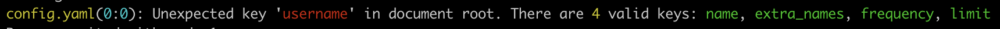

# Config: Simple, efficient YAML -> `struct` converter

## Why (would I use this) ?

Any decently-sized application needs to eventually be configured.
When an application's complexity is past the threshold where its options can be
managed by command line arguments alone, one need to add a configuration file.

Enter a myriad of questions:
- What format do I use ?
- How do I document it ?
- What are sensible default values ?
- How do I accurately report errors ?

And so on. This framework provide an opiniated answer to all those questions.

## How (do I use this) ?

Let's start with an hello world:

```D
module helloworld;

import agora.config.Config;

import std.stdio;
import std.typecons;
import core.thread;

struct Config
{
    /// The name to greet
    string name;

    /// Other people to greet
    SetInfo!(string[]) extra_names;

    /// How often to greet the user
    Duration frequency = 1.seconds;

    /// How many times should we repeat the greeting (0: no limit)
    @Optional size_t limit;
}

int main (string[] args)
{
    // `parseConfigSimple` will print to `stderr` if an error happened
    Nullable!Config configN = parseConfigFileSimple!Config("config.yaml");
    if (configN.isNull())
        return 1;
    auto config = configN.get();

    // Your program goes here
    for (size_t i = 0; config.limit == 0 || i < config.limit; ++i)
    {
        writeln("Hello World to you ", config.name);
        if (config.extra_names.set)
            writefln("And to you too, %-(%s, %)", config.extra_names.value);
        Thread.sleep(config.frequency);
    }
    return 0;
}
```

This code can be found [here](examples/helloworld/), along with the associated configuration:
```YAML
name: "Lord Commander Tenant"
extra_names:
  - The Gary
  - Mooncake
```

This demonstrate a few important properties of the config parser:
- Any field with an initializer (different from `.init`) is considered optional;
- Fields can be set to optional through to `Optional` UDA if their `init` value should be their default;
- Using `SetInfo` allows on to have optional fields that carry whether they were set or not;
- `Duration` is natively parsed;

## Full documentation

The full, up-to-date API documentation can be found [here](https://bosagora.github.io/config/).
A list of example for common use cases can be found [here](doc/FAQ.md).

## Rich error reporting

Because humans make mistakes, and configuration are aimed towards humans, special care is given to errors.
Using the [helloworld](examples/helloworld) example, here are some of the errors that would be reported:
```YAML
# Missing required option `name`
limit: 1
```


```YAML
# Wrong key: Should be `name`, not `username`
username: "Lord Commander Tenant"
```



This error is optional, but enabled by default. See `strict mode` in documentation.
